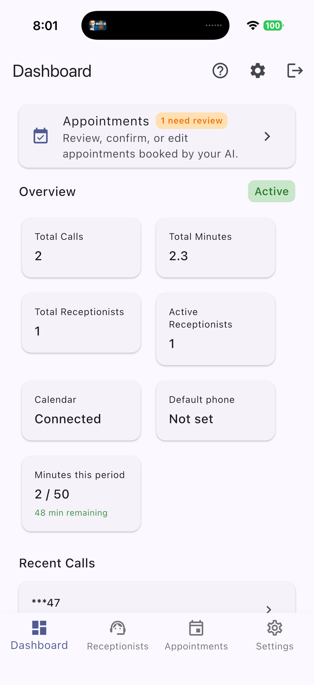
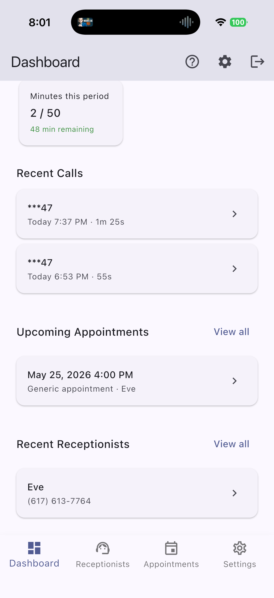
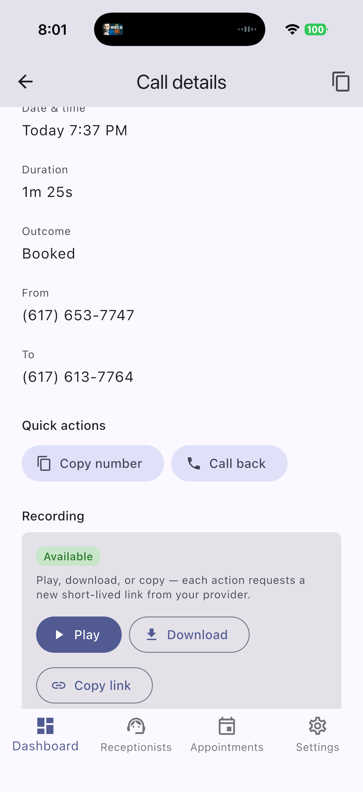
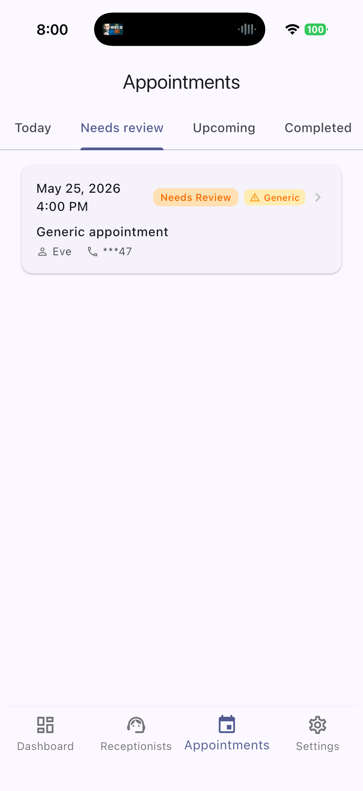
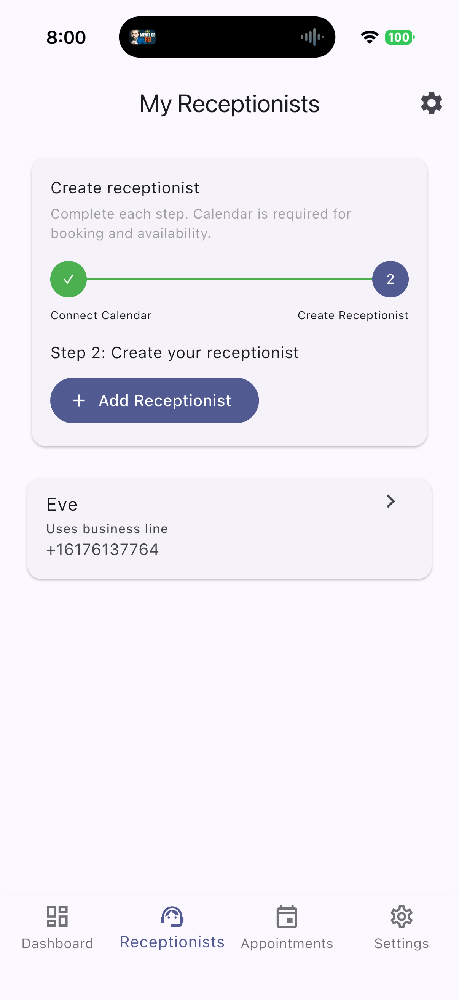
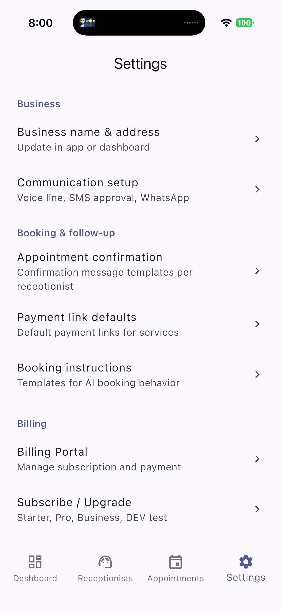
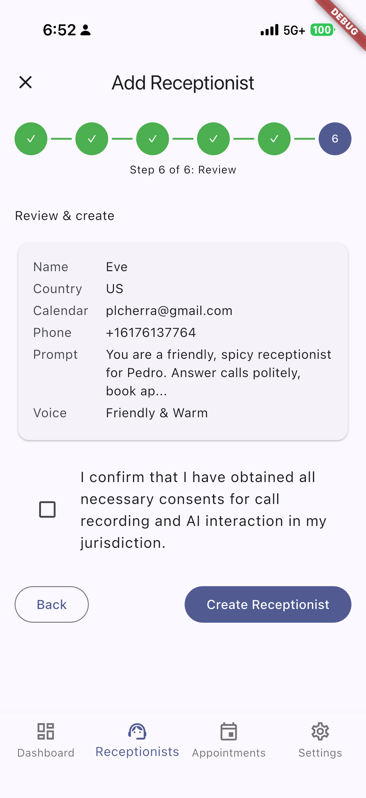
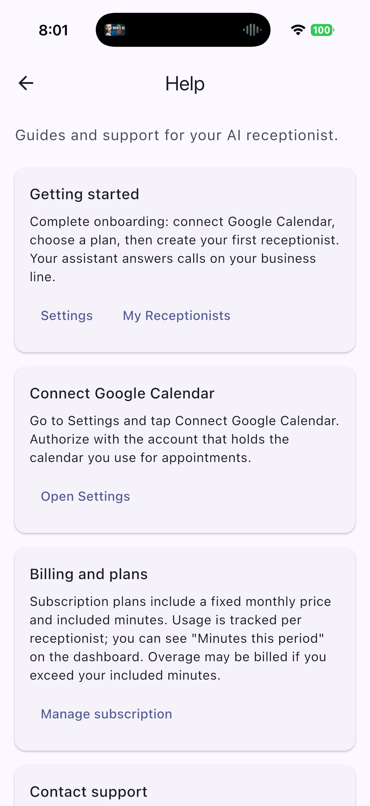

# Echodesk - AI Receptionist Platform

Echodesk is a mobile-first AI receptionist for service businesses. It answers inbound calls, talks naturally with customers, checks calendar availability, books appointments, stores recordings, and gives the business owner a simple app to review calls, appointments, billing, and receptionist setup.

Built as a production-style full-stack system: Flutter mobile app, FastAPI backend, Supabase auth/data, Telnyx voice infrastructure, Google Calendar OAuth, Stripe billing, Deepgram speech-to-text, Grok reasoning, and Google Cloud text-to-speech.

## Product Screens

<p align="center">
  
  
  
</p>

<p align="center">
  
  
  
</p>

<p align="center">
  
  
</p>

Screenshots show demo/test account data from a development build.

## What The App Does

- **Answers real phone calls** through Telnyx voice webhooks and a real-time WebSocket voice pipeline.
- **Understands callers** with Deepgram speech-to-text and routes conversations through an AI receptionist prompt.
- **Books appointments** by checking Google Calendar availability and creating calendar events.
- **Tracks business activity** with mobile dashboards for calls, usage, receptionists, and appointments.
- **Stores call history and recordings** with short-lived recording links for play, download, and sharing.
- **Supports subscriptions** through Stripe Checkout and Billing Portal flows.
- **Handles operational setup** for business profile, communication setup, SMS compliance, and help flows.

## Portfolio Highlights

- Designed and implemented a full iOS-ready Flutter app with onboarding, auth, dashboard, receptionist setup, appointment review, call history, recordings, settings, billing, and support.
- Built a FastAPI backend that powers mobile APIs, voice calls, OAuth callbacks, Stripe webhooks, Telnyx webhooks, and scheduled billing/usage jobs.
- Integrated multiple external systems into one workflow: Supabase, Telnyx, Deepgram, Grok, Google Cloud TTS, Google Calendar, Stripe, Firebase messaging, and Crashlytics.
- Added production deployment assets for Nginx, systemd, environment validation, health checks, and VPS operations.
- Documented core operational flows for voice, SMS, environment variables, deployment, and QA.

## Architecture

```text
Caller
  -> Telnyx phone number
  -> FastAPI voice webhook / WebSocket
  -> Deepgram STT
  -> Grok conversation + booking tools
  -> Google Calendar availability/events
  -> Google Cloud TTS
  -> Telnyx audio back to caller

Business owner
  -> Flutter mobile app
  -> Supabase auth session
  -> FastAPI mobile API
  -> Supabase data + Stripe + Google OAuth + Telnyx resources
```

## Tech Stack

- **Mobile:** Flutter, iOS build/signing, Firebase Messaging, Crashlytics
- **Backend:** Python, FastAPI, WebSocket voice pipeline, pytest
- **Data/Auth:** Supabase Auth, Supabase Postgres
- **Voice AI:** Telnyx, Deepgram, Grok, Google Cloud Text-to-Speech
- **Scheduling:** Google Calendar OAuth and calendar event creation
- **Billing:** Stripe Checkout, Billing Portal, webhooks, usage tracking
- **Landing/Deploy:** Static landing page, Nginx, systemd, VPS scripts

## Repository Structure

```text
backend/      Python FastAPI backend for voice, mobile API, OAuth, Stripe, cron
mobile/       Flutter mobile application
landing/      Static marketing/landing page
deploy/       Nginx, systemd, deploy scripts, environment examples
docs/         Canonical product, ops, voice, SMS, and environment docs
scripts/      Local validation and utility scripts
assets/       README media and portfolio screenshots
artifacts/    Generated verification artifacts
```

## Quick Start

### Backend

```bash
python3 -m venv venv
./venv/bin/pip install -r backend/requirements.txt
cp deploy/env/.env.example .env.local
./venv/bin/python scripts/validate-env.py
./venv/bin/uvicorn backend.main:app --reload --port 8000
```

### Mobile

```bash
cd mobile
flutter pub get
flutter run --dart-define=API_BASE_URL=http://localhost:8000
```

### Landing

Open `landing/dist/index.html` directly, or serve it with the Nginx template in `deploy/`.

## Environment Variables

See `deploy/env/.env.example` and `docs/core/ENV.md`. Key groups include Supabase, Telnyx, `DEEPGRAM_API_KEY`, `GROK_API_KEY`, Google TTS credentials, Stripe, OAuth, Firebase, and deployment URLs.

## Documentation Rules

- Canonical docs are exactly the Markdown files allowed by [`scripts/check-docs.sh`](scripts/check-docs.sh), described in [`docs/README.md`](docs/README.md).
- Behavior changes should include docs updates when they affect operators or integrations.
- `docs/core/VOICE_PIPELINE.md` and `docs/core/SMS_FLOW.md` describe intended behavior. If code disagrees, treat that as a bug unless intentionally changing the contract.

## Docs

Start with [`docs/README.md`](docs/README.md) for the full technical documentation map.
